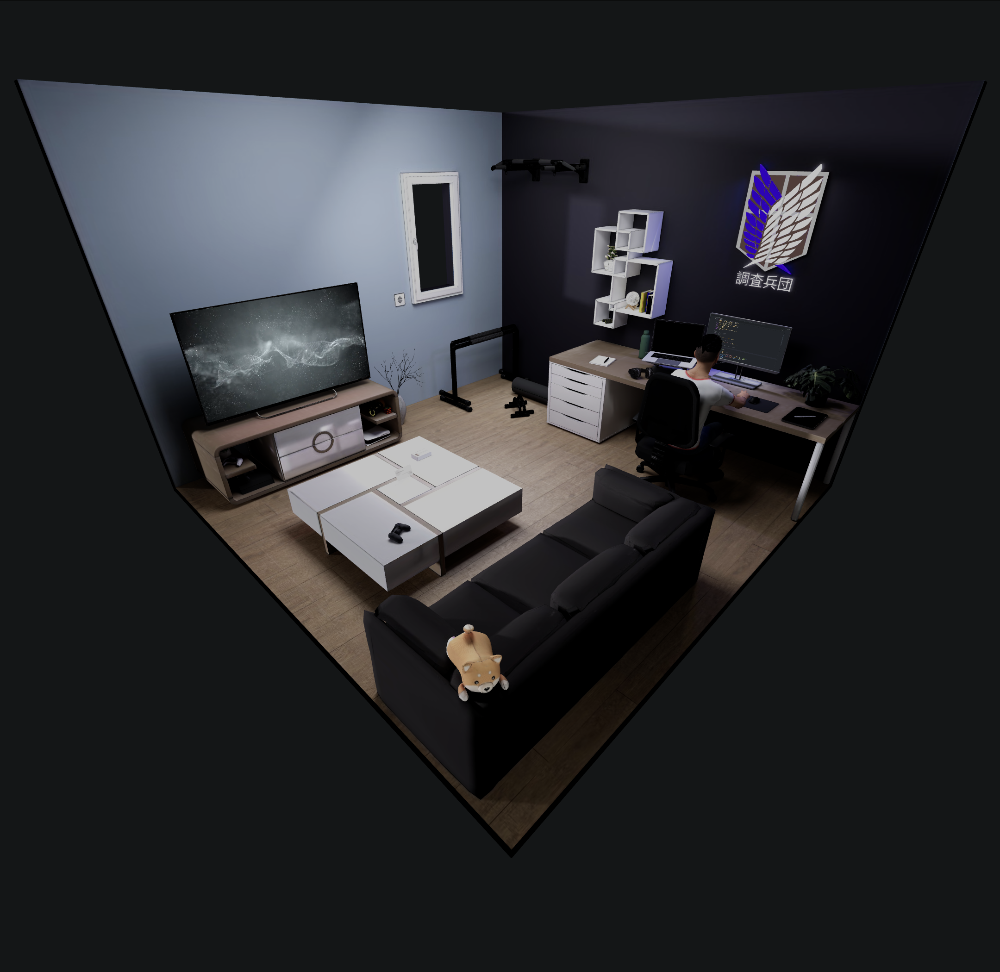

# React Three Fiber Portfolio

This project is a personal 3D portfolio built using **React Three Fiber** and **Vite**.



## Demo

A live version of this portfolio can be viewed here: [Live Portfolio](https://sajid-rehan.github.io/r3f-portfolio/)

## Installation

To run the project locally, follow these steps:

1. **Clone the repository**:

   ```bash
   git clone https://github.com/sajid-rehan/r3f-portfolio.git
   cd r3f-portfolio
   ```

2. **Install dependencies**:
   If using Yarn:

   ```bash
   yarn install
   ```

   Or if using npm:

   ```bash
   npm install
   ```

3. **Start the development server**:
   If using Yarn:
   ```bash
   yarn dev
   ```
   Or if using npm:
   ```bash
   npm run dev
   ```

## Usage

Once the server is running, you can view the portfolio locally at:

```
http://localhost:5173
```

## File Structure

Here's an overview of the project's file structure:

```bash
.
├── public
│   ├── assets            # Static assets (e.g., images)
│   ├── models            # 3D models used in the portfolio
│   └── textures          # Texture files used in the scene
├── src
│   ├── components        # React components for the portfolio
│   ├── contexts          # Contexts for state management (animations, navigation, etc.)
│   ├── data              # Data file (personal information, project details)
│   ├── util              # Utility functions for camera, notifications, etc.
│   ├── App.jsx           # Main component for the portfolio
│   ├── index.css         # Global styles
│   ├── main.jsx          # Entry point for the React app
├── package.json          # Project dependencies and scripts
├── vite.config.js        # Vite configuration file
└── README.md             # Project documentation
```

---

## To-Do

- [ ] **Cross-Browser Compatibility**

  - [ ] **Mobile Chrome:** Resolve the issue where the laptop screen HTML component is truncated, appearing cut in half.
  - [ ] **Mobile Firefox:** Address the missing background on the close button for the HTML component, ensuring it displays correctly.
  - [ ] **Safari Desktop:** Adjust the positioning of the HTML component, as it is currently rendered significantly higher than its intended position.

- [ ] **Responsiveness**

  - [ ] Ensure full responsiveness by adjusting the height of the project for various device dimensions. Currently, the project only adapts to width, leading to issues on devices with unconventional aspect ratios, causing the scene to extend beyond the screen boundaries.

- [ ] **Add Projects Section**

  - Create a dedicated section to showcase my key projects.

---

## License

This project is licensed under the MIT License. You are free to use, modify, and distribute it as long as you retain the original copyright.
